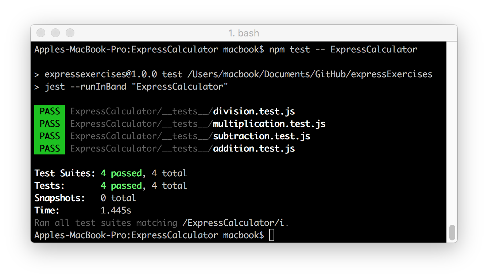

# ExpressCalculator
An Express calculator application using `GET` route with three parameters; an operation, and two numbers.

Includes four basic mathematical operations: addition, subtraction, multiplication, and division.

When the route is hit, browser displays the result of the math operation; url `http://localhost:3000/addition/7/7`, page displays 14.

### Built with
* [npm](https://www.npmjs.com/) - Node Package Manager
* [Jest](https://facebook.github.io/jest/) - JavaScript Testing Framework
* [Express](https://expressjs.com/) - Server-side JavaScript Framework
* [Postman](https://www.getpostman.com/) - Tool for Testing API

